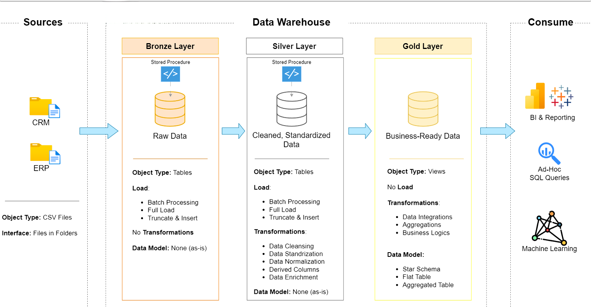

# 🏗️ SQL Data Warehouse Project

An end-to-end **SQL Data Warehouse** built using **Microsoft SQL Server**, implementing the **Medallion Architecture (Bronze, Silver, Gold layers)** to transform raw data into business-ready insights for analytics and reporting.

---

## 📊 Solution Architecture



The system is designed using a layered architecture that separates raw ingestion, data transformation, and business-ready reporting data. This ensures scalability, maintainability, and high data quality.

---

## 🏛️ Architecture Overview

The data warehouse follows the **Medallion Architecture**, consisting of three logical layers:

### 🥉 Bronze Layer – Raw Data

The Bronze layer acts as the landing zone for all incoming raw data from source systems.

#### Responsibilities
- Load raw data from CRM and ERP systems  
- Preserve data in its original format  
- Support full data refresh loads  
- Store historical raw data without transformation  

#### Objects
- Tables  
- Stored Procedures  

---

### 🥈 Silver Layer – Cleaned & Standardized Data

The Silver layer processes and transforms raw data into a clean and consistent format.

#### Responsibilities
- Data cleansing and standardization  
- Handling missing values and duplicates  
- Data validation and quality checks  
- Applying business rules and transformations  

#### Objects
- Tables  
- Stored Procedures  

---

### 🥇 Gold Layer – Business Data

The Gold layer contains business-ready, analytics-optimized datasets.

#### Responsibilities
- Data modeling for analytics  
- Aggregations and KPI creation  
- Business logic implementation  
- Reporting-ready datasets  

#### Objects
- Fact Tables  
- Dimension Tables  
- Views  
- Star Schema  

---

## 🔄 Data Flow

```text
CRM / ERP Sources
        ↓
Bronze Layer (Raw Data)
        ↓
Silver Layer (Cleaned Data)
        ↓
Gold Layer (Business Data)
        ↓
BI Tools / SQL Analysis / Reporting
```

---

## 🛠️ Technologies Used

- Microsoft SQL Server  
- SQL (T-SQL)  
- SQL Server Management Studio (SSMS)  
- Stored Procedures  
- Views  
- ETL Concepts  
- Data Warehousing Principles  
- Star Schema Modeling  

---

## ✨ Key Features

- End-to-end ETL pipeline  
- Medallion architecture implementation  
- Multi-source data ingestion (CRM & ERP)  
- Data cleansing & transformation layers  
- Business-ready reporting model  
- Scalable warehouse design  
- Star schema-based modeling  

---

## 📂 Project Structure

```text
SQL-Data-Warehouse/
│
├── datasets/
│   ├── crm/
│   └── erp/
│
├── scripts/
│   ├── bronze/
│   ├── silver/
│   ├── gold/
│
├── docs/
│   └── DWH_Architecture.png
│
└── README.md
```

---

## 📈 Business Value

This data warehouse enables organizations to:

- Centralize enterprise data  
- Improve data quality and consistency  
- Enable faster reporting and analytics  
- Support data-driven decision making  
- Build scalable BI solutions  

---

## 🚀 Future Enhancements

- Incremental data loading  
- Change Data Capture (CDC)  
- Automated ETL pipelines (SQL Agent)  
- Power BI dashboard integration  
- Cloud migration (Azure Synapse / ADF)  

---

## 👨‍💻 Author

**Ajay Kumar**

- GitHub: https://github.com/yourusername  
- LinkedIn: https://linkedin.com/in/yourprofile  

---

⭐ If you found this project useful, don’t forget to star the repository!
